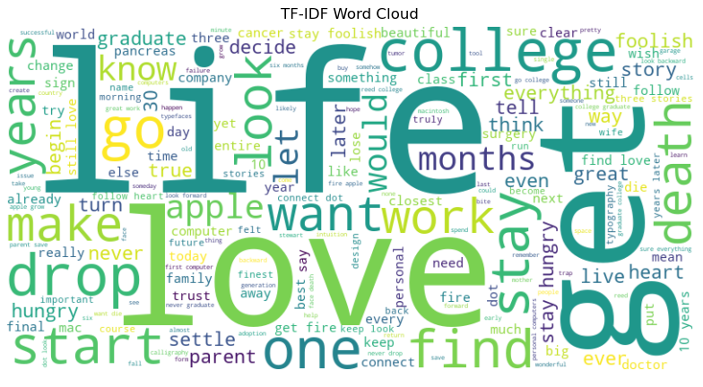

# 🚀 Text Preprocessing & TF-IDF Visualization

## 📖 Overview
This repository provides a **Natural Language Processing (NLP) pipeline** for text preprocessing and TF-IDF vectorization. It includes essential techniques like **tokenization, stopword removal, lemmatization, stemming, and TF-IDF transformation**, along with powerful data visualizations such as **word clouds, heatmaps, bar charts, and PCA scatter plots**.

## ✨ Key Features
- ✅ **Text Preprocessing**: Tokenization, stopword removal, lemmatization, and stemming  
- ✅ **TF-IDF Vectorization**: Convert raw text into meaningful numerical representations  
- ✅ **Data Visualization**:  
  - 🔥 TF-IDF Heatmap for word importance  
  - 📊 Bar chart of key TF-IDF terms  
  - 🎨 Word Cloud highlighting important words  
  - 📉 PCA Scatter Plot for dimensionality reduction  
- ✅ **Scalable & Modular**: Designed for easy integration into various NLP tasks  

## 📂 Project Structure
```
📦 your-repo-name
├── 📂 data/                 # Dataset storage (if applicable)
├── 📂 notebooks/            # Jupyter Notebooks for processing & visualization
│   ├── 📄 text_preprocessing.ipynb  # Main notebook
├── 📂 scripts/              # Python scripts for automation
│   ├── 📄 preprocess.py     # Text preprocessing functions
│   ├── 📄 tfidf_visualization.py  # Visualization scripts
├── 📄 README.md             # Project documentation
```

## ⚡ Installation
### 1️⃣ Clone the Repository
```bash
git clone https://github.com/your-username/your-repo-name.git
cd your-repo-name
```

### 2️⃣ Install Dependencies
```bash
pip install -r requirements.txt
```
*(Ensure `nltk`, `sklearn`, `matplotlib`, `seaborn`, and `wordcloud` are installed.)*

### 3️⃣ Download NLTK Resources
```python
import nltk
nltk.download('punkt')
nltk.download('stopwords')
nltk.download('wordnet')
```

## 🛠 Usage
### ▶️ Running the Jupyter Notebook
```bash
jupyter notebook notebooks/text_preprocessing.ipynb
```

### ▶️ Running the Preprocessing Script
```bash
python scripts/preprocess.py
```

## 📊 Example Outputs
Here are some of the visualizations generated by the pipeline:

- **🔥 TF-IDF Heatmap** – Shows word importance across sentences  
- **📊 Bar Chart** – Highlights top TF-IDF words  
- **📉 PCA Scatter Plot** – Projects high-dimensional data into 2D  
- **🎨 Word Cloud** – Displays frequently important words  

### **TF-IDF Word Cloud Example**


## 📊 Observations from the TF-IDF Word Cloud

The TF-IDF Word Cloud represents the most significant words from **Steve Jobs' famous speech**. Below are key observations:

1. **Key Themes**:  
   - Prominent words like **"life," "love," "get," "college," "death," "drop," "start," and "work"** highlight the core themes of Jobs' speech: **passion, perseverance, and purpose**.

2. **Education & Career**:  
   - Words such as **"college," "drop," "graduate," and "class"** reflect Jobs' personal experience with **dropping out of college** and how unconventional paths can lead to success.

3. **Passion & Purpose**:  
   - Strong words like **"love," "find," "want," and "stay"** indicate Jobs' emphasis on **following one’s passion** and doing work that truly matters.

4. **Overcoming Challenges**:  
   - Terms like **"death," "cancer," "hungry," and "foolish"** point to Jobs' thoughts on **mortality and motivation**, emphasizing the urgency to **live life fully**.

5. **Innovation & Apple**:  
   - Words such as **"apple," "computer," "design," and "mac"** highlight his legacy in **technology and product innovation**.

6. **Taking Risks & Trusting the Process**:  
   - The presence of **"begin," "start," "trust," and "turn"** aligns with Jobs' belief in **embracing change, trusting intuition, and taking bold risks**.

7. **Iconic Advice**:  
   - Words like **"stay" and "hungry"** reflect his famous advice:  
     > *"Stay hungry, stay foolish."*  
     Urging people to **keep learning, stay curious, and take fearless leaps in life**.

---

## 🎯 Summary  

The word cloud visually captures the **essence of Steve Jobs' inspiring message**. It emphasizes **pursuing passion, embracing uncertainty, trusting intuition, and living with purpose**. His words continue to serve as a **blueprint for innovation, resilience, and personal growth**.

---

## 🔥 Future Enhancements
- 🔹 **Named Entity Recognition (NER)** for identifying key entities  
- 🔹 **Topic Modeling (LDA, BERTopic)** for discovering hidden themes  
- 🔹 **Interactive Visualizations** using Plotly or Bokeh  
- 🔹 **Deep Learning Integration** with Transformer-based models (BERT, GPT)  

## 🛡️ License
This project is licensed under the **MIT License** – feel free to use and modify!  

## 🤝 Contributing
🚀 **Fork**, **Branch**, & **Pull Request**! Your contributions are welcome!  

## 💬 Connect
For suggestions or questions, feel free to open an **issue** or reach out via **[LinkedIn](https://www.linkedin.com/in/shusmita-budha-6805b2169)**.  

---
⭐ _If you find this useful, give it a ⭐ on GitHub!_ 🚀  
